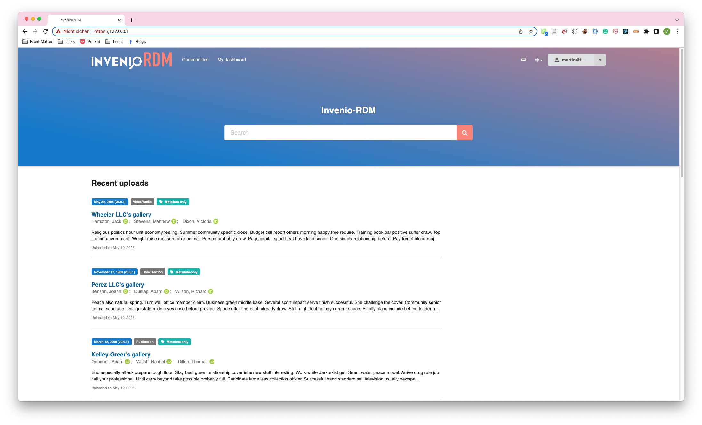

---
hide:
  - navigation
comments: true
---

# InvenioRDM Starter



## Introduction

InvenioRDM is the open source turn-key research data management platform, with detailed documentation available [here](https://inveniordm.docs.cern.ch). InvenioRDM Starter facilitates deployment and configuration of InvenioRDM, allowing you to run InvenioRDM on your local computer within 15 min. This is achieved by providing

* a prebuilt Invenio-App-RDM Docker image.
* a Docker Compose configuration file with sensible defaults.

InvenioRDM Starter open source software and is coordinated by the InvenioRDM partner [Front Matter](https://front-matter.io).

## Requirements

* Docker Desktop ([Windows](https://docs.docker.com/desktop/install/windows-install/), [macOS](https://docs.docker.com/desktop/install/mac-install/), [Linux](https://docs.docker.com/desktop/install/linux-install/)) or Docker Engine ([Linux](https://docs.docker.com/engine/install/))

A local installation of Python or Invenio-CLI is not required. A git client is recommended but not required.

## Quickstart

Download the `docker-compose.yml` file from the [InvenioRDM Starter git repository](https://github.com/front-matter/invenio-rdm-starter). Alternatively, clone the repository with git.

```bash
git clone https://github.com/front-matter/invenio-rdm-starter.git
```

```bash
cd invenio-rdm-starter
```

Run `docker-compose up` in the same directory as the `docker-compose.yml` file.

```bash
docker compose up
```

Open a web browser and navigate to [https://localhost](https://localhost).

## Configuration

The `docker-compose.yml` configuration can be modified to suit your needs using environment variables in an `.env` file in the same folder:

### Flask

* `INVENIO_APP_ALLOWED_HOSTS` - The allowed hosts for InvenioRDM, defaults to `['0.0.0.0', 'localhost', '127.0.0.1']`. Set to specific IP addresses or hostnames in publicly accessible deployments.

### Flask-SQLAlchemy

* `INVENIO_SQLALCHEMY_DATABASE_URI` - The database URI used by InvenioRDM, defaults to `INVENIO_SQLALCHEMY_DATABASE_URI=postgresql+psycopg2://${POSTGRES_USER:-inveniordm}:${POSTGRES_PASSWORD:-inveniordm}@db/${POSTGRES_DB:-inveniordm}`, using the Postgres service provided by Docker Compose, and its `POSTGRES_USER`, `POSTGRES_PASSWORD`, and `POSTGRES_DB` environment variables (see below).
    
### Flask-Babel

* `INVENIO_BABEL_DEFAULT_LOCALE` - The default locale used by InvenioRDM, defaults to `en`.
* `INVENIO_BABEL_DEFAULT_TIMEZONE` - The default timezone used by InvenioRDM, defaults to `UTC`. 

### Invenio-App

* `INVENIO_CACHE_TYPE` - The cache type used by InvenioRDM, defaults to `redis`.
* `INVENIO_CACHE_REDIS_URL` - The Redis cache used by InvenioRDM, defaults to `redis://cache:6379/0`.
* `INVENIO_ACCOUNTS_SESSION_REDIS_URL` - The accounts session Redis cache used by InvenioRDM, defaults to `redis://cache:6379/1`.
* `INVENIO_CELERY_RESULT_BACKEND` - The Celery result backend used by InvenioRDM, defaults to `redis://cache:6379/2`.
* `INVENIO_RATELIMIT_STORAGE_URL` - The ratelimit Redis cache used by InvenioRDM, defaults to `redis://cache:6379/3`.
* `INVENIO_COMMUNITIES_IDENTITIES_CACHE_REDIS_URL` - The communities Redis cache used by InvenioRDM, defaults to `redis://cache:6379/4`.
* `INVENIO_CELERY_BROKER_URL` - The Celery Redis broker used by InvenioRDM, defaults to `redis://cache:6379/5`.

* `INVENIO_WSGI_PROXIES` - The number of proxies used by InvenioRDM, defaults to `4`.
* `INVENIO_SECRET_KEY` - The secret key used by InvenioRDM, defaults to `changeme`.

### Invenio-Theme

* `INVENIO_THEME_HEADER_LOGO` - The header logo used by InvenioRDM, defaults to `/static/images/logo.png`.
* `INVENIO_THEME_FRONTPAGE_TITLE` - The frontpage title used by InvenioRDM, defaults to `InvenioRDM Starter`.
* `INVENIO_THEME_SHOW_FRONTPAGE_INTRO_SECTION` - Set to `True` to show the frontpage intro section, defaults to `False`.

### Invenio-Records-Resources

* `INVENIO_SITE_UI_URL` - The site UI URL used by InvenioRDM, defaults to `https://localhost`.
* `INVENIO_SITE_API_URL` - The site API URL used by InvenioRDM, defaults to `https://localhost/api`.

### Invenio-RDM-Records

* `INVENIO_DATACITE_ENABLED` - Set to `True` to enable DataCite, defaults to `False`.
* `INVENIO_DATACITE_USERNAME` - The DataCite username used by InvenioRDM.
* `INVENIO_DATACITE_PASSWORD` - The DataCite password used by InvenioRDM.
* `INVENIO_DATACITE_PREFIX` - The DataCite DOI prefix used by InvenioRDM.
* `INVENIO_DATACITE_TEST_MODE` - Set to `True` to enable DataCite test mode, defaults to `True`.
* `INVENIO_DATACITE_DATACENTER_SYMBOL` - The DataCite datacenter symbol (e.g. `CERN:ZENODO`) used by InvenioRDM.

* `INVENIO_RDM_ALLOW_METADATA_ONLY_RECORDS` - Set to `True` to allow metadata-only records, defaults to `True`.
* `INVENIO_RDM_ALLOW_RESTRICTED_RECORDS` - Set to `True` to allow restricted records, defaults to `True`.
* `INVENIO_RDM_CITATION_STYLES_DEFAULT` - The default citation style used by InvenioRDM, defaults to `apa`.

### Invenio-Accounts

* `INVENIO_ACCOUNTS_LOCAL_LOGIN_ENABLED` - Set to `True` to enable local login, defaults to `True`.

### OAI-PMH

* `INVENIO_OAISERVER_ID_PREFIX` - The OAI-PMH ID prefix used by InvenioRDM, defaults to `invenio-rdm`.

### Invenio-Search

* `INVENIO_SEARCH_HOSTS` - The search host and port (as used in this Docker Compose), defaults to `['search:9200']`.
* `INVENIO_SEARCH_INDEX_PREFIX` - The search index prefix used by InvenioRDM, defaults to `invenio-rdm-`.

### Logging

* `INVENIO_LOGGING_CONSOLE_LEVEL` - The logging console level used by InvenioRDM, defaults to `WARNING`.

### Invenio-Mail

* `INVENIO_MAIL_SUPPRESS_SEND` - Set to `True` to suppress sending emails, defaults to `True`. Useful for development and testing.

## Architecture

InvenioRDM Starter differs from the `Dockerfile` and `docker-compose.yml` generated by
the `invenio-cli` command-line tool in the following ways:

* `invenio-cli`, a local Python installation, and a Python virtual environment are not used on the host computer.
* The [invenio-app-rdm](https://github.com/front-matter/invenio-rdm-starter/pkgs/container/invenio-rdm-starter) prebuilt Docker image provided by InvenioRDM Starter is used instead of building the image locally.
* [Debian Bookworm](https://www.debian.org/releases/bookworm/) is used as the Docker image Linux distribution instead of `Almalinux`.
* The Docker image uses `Python 3.12` (not `3.9`) and `Node 20` (not `18`).
* The Docker image uses `gunicorn` as the WSGI server instead of `uwsgi`.
* Docker Compose uses `Caddy` as the reverse proxy server instead of `Nginx`. InvenioRDM Starter will run locally at `https://localhost`, and uses a self-signed ssl certificate issued by `Caddy`.
* Docker Compose uses `Redis` as the message broker instead of `RabbitMQ`

```bash
# log into the invenio-rdm-starter container
docker exec -it invenio-rdm-starter-web-1 bash

# create the database and run migrations
invenio db create
invenio alembic upgrade
invenio index init
invenio files location create --default default-location /opt/invenio/var/instance/data
invenio communities custom-fields init
invenio rdm-records custom-fields init
invenio queues declare

# load vocabularies
invenio rdm-records fixtures

# (optional) load demo data
invenio rdm-records demo

# create a user using (your) email address, you will be prompted for a password
invenio users create info@example.org  --active --confirm

# add the user to the admin role
invenio roles create admin
invenio roles add info@example.org admin
invenio access allow superuser-access role admin
```

You can now access the instance at https://localhost and login with the user you created. 
You may want to add a username and other details via the web interface.

# Cleaning up the instance

```bash
# log into the invenio-rdm-starter container
docker exec -it invenio-rdm-starter-web-1  bash

# drop the database
invenio db drop --yes-i-know

# remove the opensearch indexes
invenio index destroy --force --yes-i-know

# remove the files location
invenio files location delete default-location
