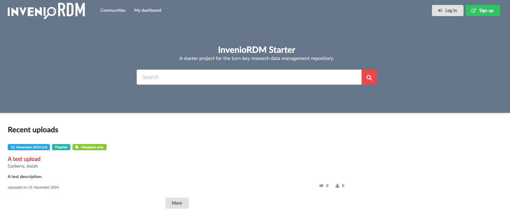

---
hide:
  - navigation
---

## Introduction

InvenioRDM Starter is an implementation of the InvenioRDM Turn-key research data management repository focusing on easy deployment and configuration. This is achieved by providing

* a prebuilt Invenio-App-RDM Docker image.
* a Docker Compose configuration file with sensible defaults.

InvenioRDM Starter is coordinated by the InvenioRDM partner Front Matter.

## Requirements

* Docker Desktop ([Windows](https://docs.docker.com/desktop/install/windows-install/), [macOS](https://docs.docker.com/desktop/install/mac-install/), [Linux](https://docs.docker.com/desktop/install/linux-install/)) or Docker Engine ([Linux](https://docs.docker.com/engine/install/))

A local installation of Python or Invenio-CLI is not required. A git client is recommended but not required.

## Quickstart

* Download the `docker-compose.yml` file from the [InvenioRDM Starter git repository](https://github.com/front-matter/invenio-rdm-starter). Alternatively, clone the repository.
* Run `docker-compose up` in the same directory as the `docker-compose.yml` file.
* Open a web browser and navigate to `https://localhost`.

## Technology Choices

InvenioRDM Starter differs from the `Dockerfile` and `docker-compose.yml` generated by
the `invenio-cli` command-line tool in the following ways:

* `invenio-cli` is not used.
* The `invenio-app-rdm` Docker prebuilt image provided by InvenioRDM Starter is used instead of building the image locally.
* [Debian Bookworm](https://www.debian.org/releases/bookworm/) is used as the Docker base image, instead of `Almalinux`.
* The Docker image uses `Python 3.12` and `Node 20`.
* The Docker image uses `gunicorn` as the WSGI server instead of `uwsgi`.
* Docker Compose uses `Caddy` as the reverse proxy server instead of `Nginx`. InvenioRDM Starter will run locally at `https://localhost`, and uses a self-signed certificate issued by `Caddy`.
* Docker Compose uses `Redis` as the message broker instead of `RabbitMQ`
